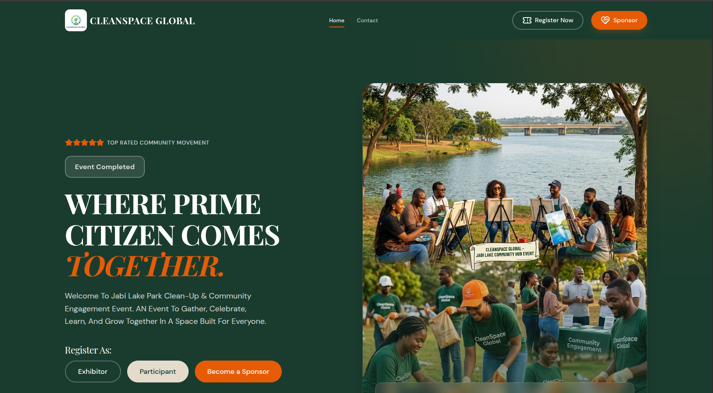
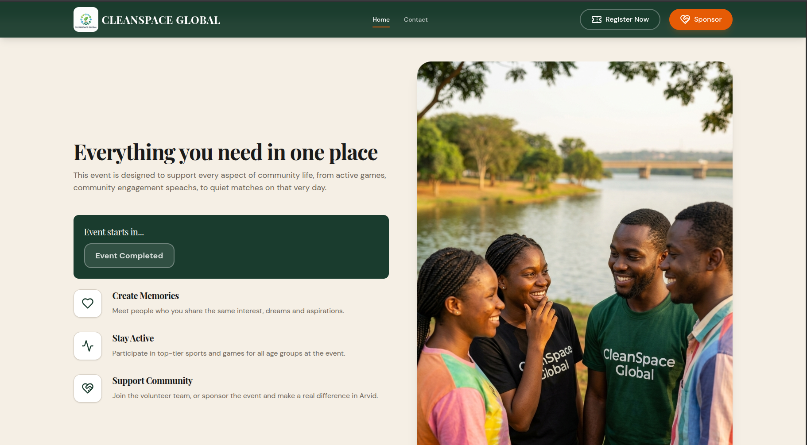
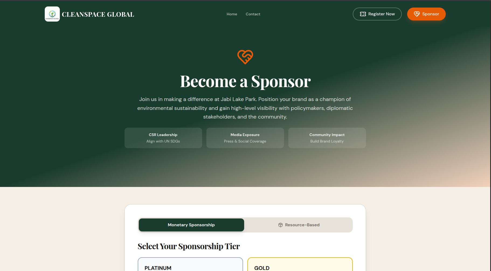

# CleanSpace Global — Jabi Lake Community Hub

> **Live Site:** [cleanspaceglobal.com.ng](https://www.cleanspaceglobal.com.ng/) &nbsp;|&nbsp; **Hosted on Vercel:** [community-engagement-plum.vercel.app](https://community-engagement-plum.vercel.app/)

---

## About the Project

CleanSpace Global is an environmental and community engagement organisation. They needed a dedicated event website for their **Jabi Lake Park Clean-Up & Community Hub Event** — a flagship gathering designed to bring citizens together around environmental sustainability, arts, sports, and civic action.

The website serves as the single digital touchpoint for the event: communicating the mission, driving registrations, and converting corporate interest into sponsorships.



---

## The Problem I Solved

The client needed to:

- **Drive event registrations** across three distinct audience types — Exhibitors, Participants, and Sponsors — each with different motivations and information needs.
- **Attract corporate sponsors** by clearly articulating brand value: CSR alignment with UN SDGs, media exposure, and community impact.
- **Establish credibility** quickly for a movement positioning itself as a top-rated community initiative.
- **Communicate urgency** with a live event countdown and clear calls to action.

A generic template wouldn't cut it. The site needed intentional UX, a strong visual identity, and conversion-focused copy — all delivered on a tight timeline.

---

## What I Built

### Conversion-Focused Landing Page
A hero section that immediately communicates the event's purpose and presents three distinct registration paths (Exhibitor, Participant, Sponsor) — reducing friction for each audience segment.



### Sponsorship Acquisition Flow
A dedicated sponsorship section with tiered packages (Platinum, Gold, and Resource-Based options), designed to help the client close corporate partnerships. Sponsors can self-select their tier and submit directly through the site.



### Event Countdown Timer
A live countdown component that created urgency and kept returning visitors informed of the event timeline.

### Multi-Role Registration System
Separate registration flows for different attendee types, built with validated forms to ensure clean data collection for the client's event management.

---

## Key Features

- Responsive design that works seamlessly across mobile, tablet, and desktop
- Animated UI with smooth transitions (Framer Motion) for a polished, professional feel
- Live event countdown timer
- Multi-role registration forms with validation (React Hook Form + Zod)
- Tiered sponsorship selection with Monetary and Resource-Based options
- Contact page for direct enquiries
- Deployed to a custom domain with zero-downtime hosting on Vercel

---

## Tech Stack

| Layer | Technology |
|---|---|
| Framework | React 18 + TypeScript |
| Styling | Tailwind CSS v4 |
| Routing | Wouter |
| Animations | Framer Motion |
| Forms | React Hook Form + Zod |
| Data Fetching | TanStack Query |
| UI Primitives | Radix UI |
| Build Tool | Vite |
| Hosting | Vercel |

---

## Results for the Client

- A professional web presence that positioned CleanSpace Global as a credible, top-rated community movement
- Clear conversion paths that turned website visitors into registered participants and paying sponsors
- A sponsorship section structured to appeal to corporate decision-makers, highlighting CSR value, media exposure, and community impact
- Full deployment to a custom `.com.ng` domain, ready for sharing across social media and press channels

---

## Looking to Work Together?

If you need a website that doesn't just look good but actively works toward your business goals — registrations, leads, sponsorships, or sales — I'd love to help.

This project is one example of translating a client's mission into a focused digital product. I work with NGOs, startups, and businesses to build fast, accessible, and conversion-driven web experiences.

---

## Running the Project Locally

```bash
git clone https://github.com/your-username/community-engagement.git
cd community-engagement
pnpm install
pnpm dev
```

Open [http://localhost:5173](http://localhost:5173) in your browser.

To build for production:

```bash
pnpm build
```
